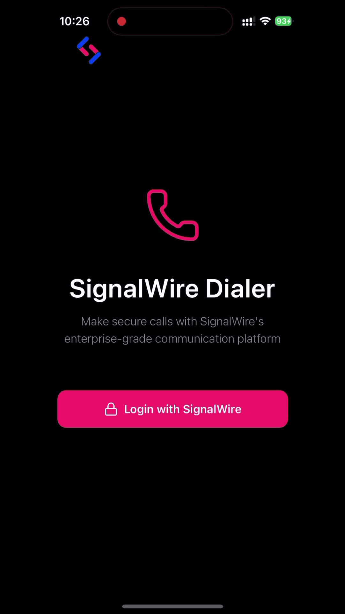

# SignalWire Dialer

A dialer application built with React Native that integrates with SignalWire for making and receiving calls with OAuth authentication.

<p align="center">
  
</p>

- OAuth2 authentication via SignalWire Subscriber API
- Make and receive calls using SignalWire
- User signup and account creation

## Project Structure

```
.
├── react-native/       # React Native mobile application
│   ├── src/
│   │   ├── components/ # Reusable UI components (DialPad, ContactPicker, etc.)
│   │   ├── contexts/   # React contexts (ClientContext)
│   │   ├── hooks/      # Custom hooks (useCallSession)
│   │   ├── navigation/ # Navigation configuration
│   │   ├── screens/    # Screen components (Welcome, SignUp, Dialer, Call)
│   │   ├── services/   # External services (auth)
│   │   ├── types/      # TypeScript type definitions
│   │   └── utils/      # Utility functions
│   ├── android/        # Android native code
│   ├── ios/            # iOS native code
│   └── assets/         # Images and media files
│
└── backend/            # Node.js backend server
    └── index.js        # Express API server with signup endpoint
```

## Prerequisites

Before you begin, ensure you have the following installed:

- Node.js (>= 20)
- React Native development environment set up for your platform
- For detailed environment setup, follow the official React Native documentation:
  - [React Native Environment Setup](https://reactnative.dev/docs/set-up-your-environment)

We are using native modules unsupported by Expo.

- For iOS development, XCode must be installed and configured as per the guide.
- For Android development, Android Studio must be installed with the correct SDK version.

## Backend Setup

The signup feature requires a backend server to create SignalWire subscribers.

1. Navigate to the backend directory:

```bash
cd backend
```

2. Install dependencies:

```bash
npm install
```

3. Create a `.env` file:

```bash
cp .env.example .env
```

4. Configure your SignalWire credentials in `.env`:

```
PORT=3000
SIGNALWIRE_SPACE_NAME=your-space-name
SIGNALWIRE_PROJECT_ID=your-project-id
SIGNALWIRE_API_TOKEN=your-api-token
```

5. Start the backend server:

```bash
npm start
```

The server will run on `http://localhost:3000`.

### Getting Your SignalWire Credentials

1. Log in to your [SignalWire Dashboard](https://signalwire.com/)
2. Your Space Name is visible in your dashboard URL: `https://your-space-name.signalwire.com`
3. Navigate to API section to get your Project ID and API Token

### Backend API Endpoints

- `POST /signup` - Creates a new SignalWire subscriber
- `GET /health` - Health check endpoint

## React Native App Setup

### Configuration

Authentication configuration is managed in `react-native/src/services/auth.ts`. Update the following:

1. **OAuth Configuration** - Update the `AUTH_CONFIG` object with your SignalWire OAuth client ID:

```typescript
const AUTH_CONFIG = {
  issuer: 'https://id.fabric.signalwire.com/',
  serviceConfiguration: {
    authorizationEndpoint:
      'https://id.fabric.signalwire.com/login/oauth/authorize',
    tokenEndpoint: 'https://id.fabric.signalwire.com/oauth/token',
  },
  clientId: 'your-signalwire-client-id-here',
  redirectUrl: 'com.dialer://oauth-callback',
  clientAuthMethod: 'post' as const,
  scopes: [],
};
```

2. **Backend URL** - Update the `SIGNUP_API_URL` constant:
   - For iOS simulator: `http://localhost:3000/signup` (default)
   - For Android emulator: `http://10.0.2.2:3000/signup`
   - For production: Update to your actual backend URL

### Installation

1. Clone the repository:

```bash
git clone https://github.com/signalwire/dialer-native
cd dialer-native
```

2. Navigate to the React Native directory:

```bash
cd react-native
```

3. Install dependencies:

```bash
npm install
```

### iOS Setup

1. Install CocoaPods dependencies:

```bash
cd ios
pod install
cd ..
```

2. Run the app:

```bash
npm run ios
```

### Android Setup

1. Make sure you have an Android emulator running or a device connected

2. Run the app:

```bash
npm run android
```

## Development

### Running the Backend

From the `backend` directory:

```bash
npm start
```

### Running the React Native App

From the `react-native` directory:

**iOS:**

```bash
npm run ios
```

**Android:**

```bash
npm run android
```
